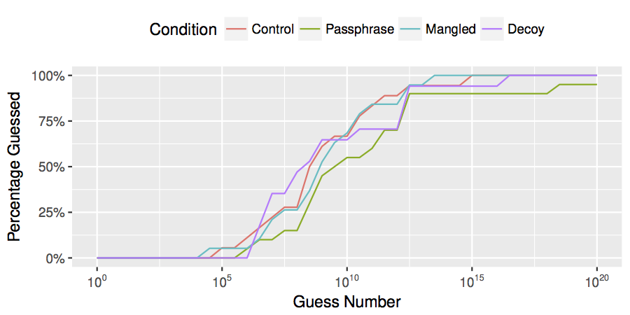
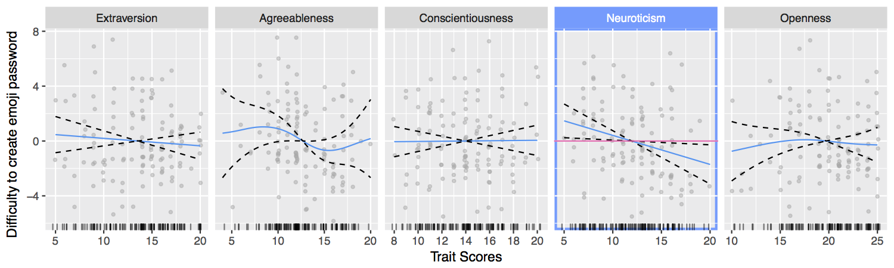

# r-swag 😎

## password-strength
Swag to plot guessability statistics and more. 

### `plotGuessNumbers()`
Creates a CMU-style guessability plot.

**Example Output**



## GAM
Swag for generalized additive models. 

### `plotGAM()`
Easy function plotGAM() in GAM/plotGAM.R to generate nice facetted plots of models created with the gam() function of the mgcv package.
The function returns a plot for the expected predictors and the control variables inside the model. 

**Basic Usage**

```language=R
model <- gam(target ~ 	predictor1 + s(predictor2) + 
						controlVariable1 + controlVariable2,
    		 data = myDF)

plots <- plotGAM(model,	controlVariables = c("controlVariable1","controlVariable2"), 
						predictors = c("predictor1","predictor2"))
```
Look at the function signature and its documentation for further paramters and options. 


**Example Output:**


### `simplifyModel()`
The purpose of this function is to model any predictor as linear where the estimated degrees of freedom of the smooth term is 1. Doing so gives you a better model coefficient for this predictor. 


## `util.R`
### savePlot()
Lets you save plots generated by ggplot2 as PDF more easily.


## Author(s)
* Tobi Seitz 🤓