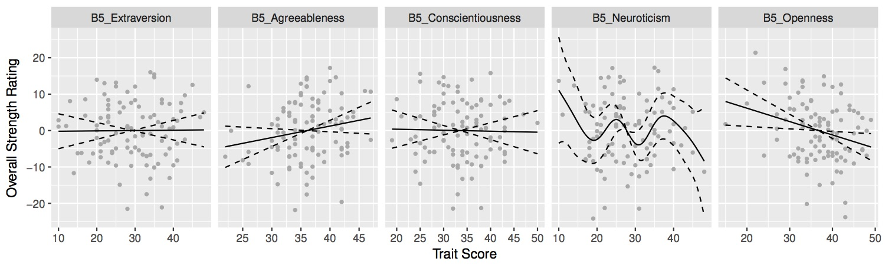

# r-swag 😎

## GAM
Easy function plotGAM() in GAM/plotGAM.R to generate nice facetted plots of models created with the gam() function of the mgcv package.
The function returns a plot for the expected predictors and the control variables inside the model. 

### Basic Usage

```language=R
model <- gam(target ~ 	predictor1 + s(predictor2) + 
						controlVariable1 + controlVariable2,
    		 data = myDF)

plots <- plotGAM(model,	controlVariables = c("controlVariable1","controlVariable2"), 
						predictors = c("predictor1","predictor2"))
```
Look at the function signature and its documentation for further paramters and options. 

### Example:



## `util.R`
### savePlot()
Let's you save plots generated by ggplot2 as PDF more easily.


## Author(s)
* Tobi Seitz 🤓